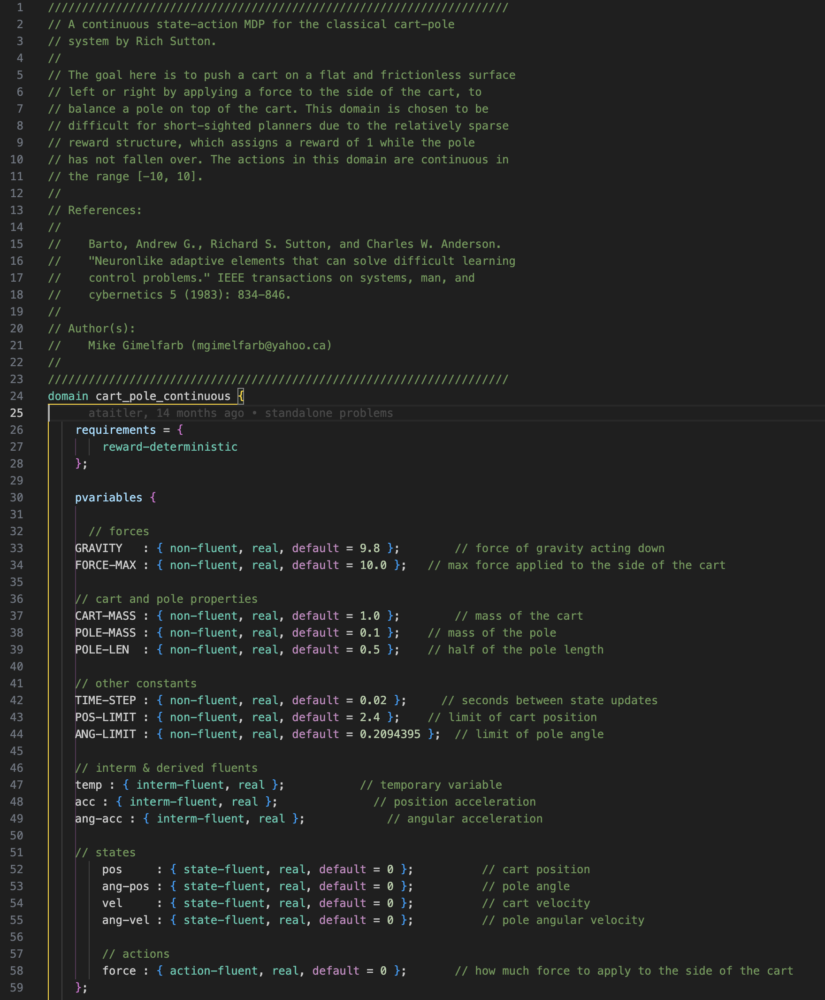
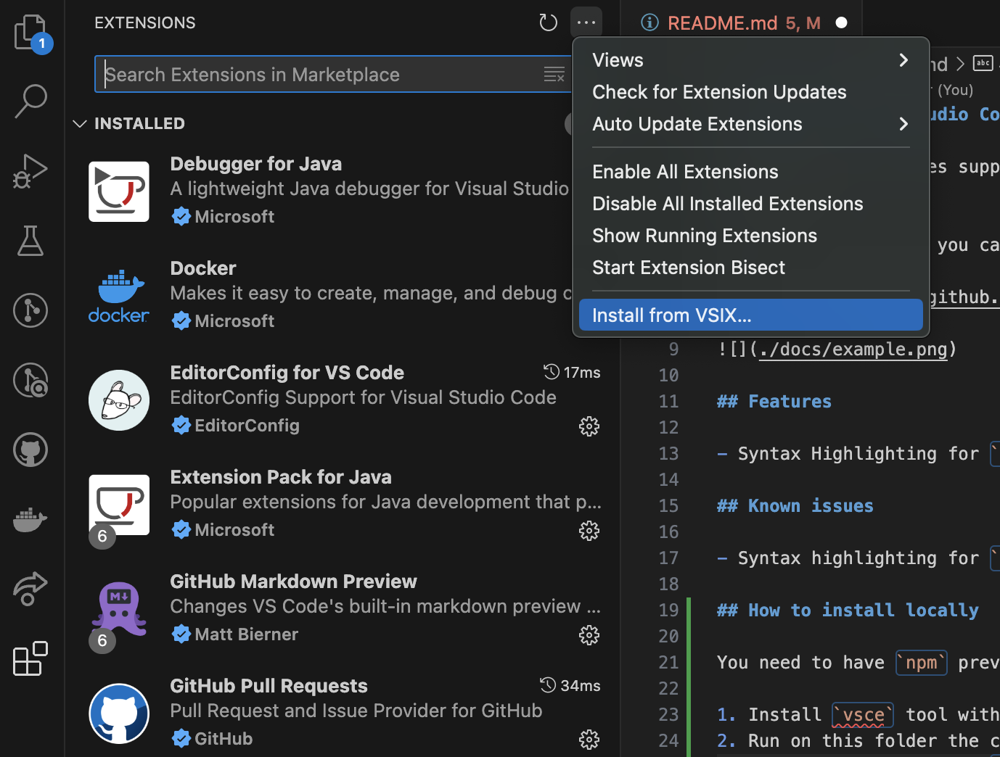

# RDDL for Visual Studio Code

This extension enables support for the Relational Dynamic Influence Diagram (RDDL) Language in Visual Studio Code, a language used to model Probabilist Planning problems.

With this extension, you can develop and see RDDL files easily and start using it to create new Probabilistic Plan domains.

Inspired on https://github.com/jan-dolejsi/vscode-pddl

## Features

- Syntax Highlighting for `*.rddl` files

## Known issues

- Syntax highlighting for `domain` and `non-fluents` keywords when declared on `non-fluents` and `instance` blocks

## How to install locally

You need to have `npm` previously installed 

1. Install `vsce` tool with `npm install -g @vscode/vsce`
2. Run on this folder the command `npm run vscode-package`
3. Once you have the file `rddl-for-vscode-0.0.1.vsix` on your machine, install it on Visual Studio Code Extension screen:

## Important links

- [RDDL IDE](https://github.com/pyrddlgym-project/rddl-ide): RDDL IDE written in Python provided by the [pyRDDLgym project](https://github.com/pyrddlgym-project)
- [RDDL Specification](https://pyrddlgym.readthedocs.io/en/latest/rddl.html#rddl-language-description): Language specification for RDDL, used to structure the plug-in Textmate grammar
- [Visual Studio Code Semantic Highlight Guide](https://code.visualstudio.com/api/language-extensions/semantic-highlight-guide): Guide used to build this plug-in
- [Texmate Grammar docs](https://macromates.com/manual/en/language_grammars): Documentation on how to build a grammar in Textmate format
- [Publishing VS Code extensions](https://code.visualstudio.com/api/working-with-extensions/publishing-extension)
